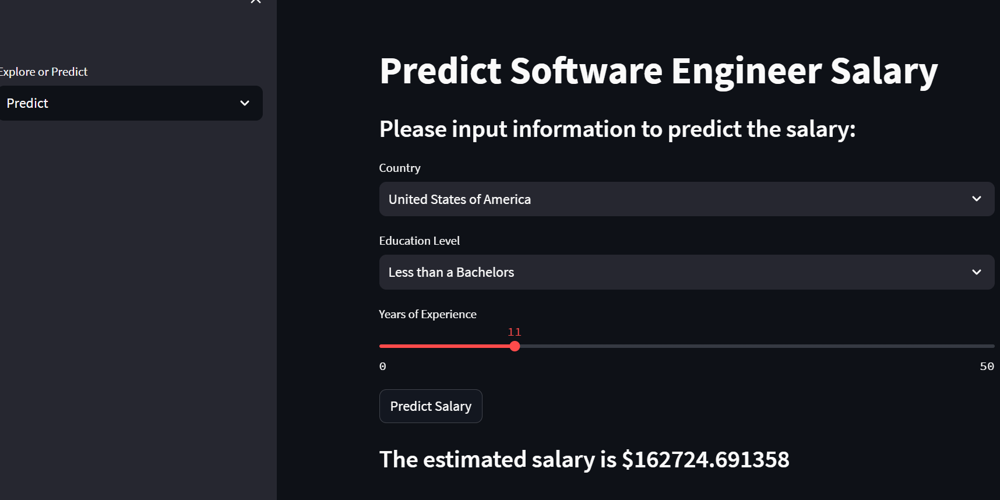

# Salary Prediction App

## Overview

The Salary Prediction App is a machine learning-based web application that predicts salaries based on Stack Overflow survey data. It uses a trained machine learning model to provide estimated salary ranges for different location, experience levels, and education.

## Features

- Input job-related details such as country, education level and years of experience.
- Click the "Predict Salary" button to receive an estimated salary range.
- User-friendly interface for easy interaction.

